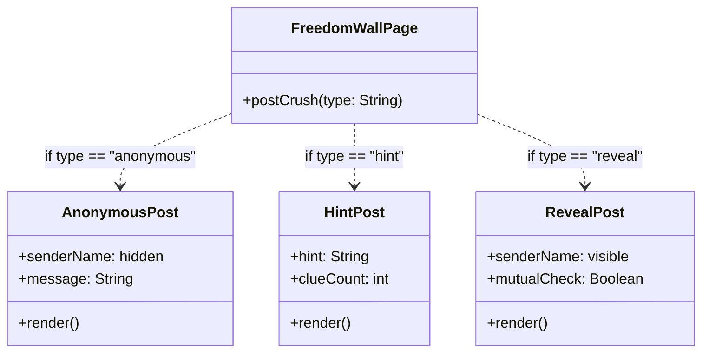
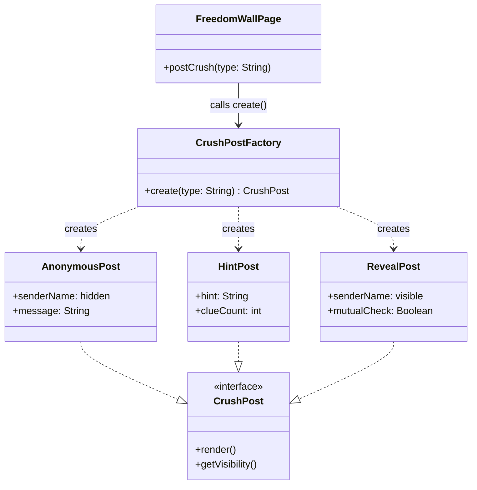

Here's the full thing:

---

## 🏗️ Design Pattern #1: Creational — Factory Method

### i. Name of Pattern
**Creational – Factory Method**
Applied to: **Freedom Wall — Crush Post Creation**

---

### ii. Concept in Conyo

Sa Freedom Wall, pwede kang mag-post ng crush mo in three ways: **anonymous** (huwag malaman kung sino ka), **hint** (pahiwatig lang), o **reveal** (lahat alam, sana mutual 🙏).

Iba-iba sila ng structure, content, at visibility — so ang tanong is, sino ang mag-de-decide kung anong klase ng post ang gagawin?

'Yan ang trabaho ng **Factory Method** — si `CrushPostFactory` na lang ang bahala sa creation. Ikaw? `create("hint")` lang, tapos na. Hindi mo na kailangan pag-isipan kung paano siya ginawa.

---

### iii. Visual Diagram

#### ❌ Without Factory Method



#### ✅ With Factory Method



---

### iv. Why it Works Nga

**✅ With Factory** — may isa na lang na nagde-decide. Lahat ng pages? Tatawag lang kay `CrushPostFactory` — siya na bahala. May bago kang post type? Sabihin mo kay Factory, tapos done. Lahat updated, walang maiiwanan.

**❌ Without Factory** — every page na gumagamit ng crush post ay kailangan mag-decide kung anong type ang gagawin. It's like deciding separately kung saan kayo kakain — walang consistent na desisyon, tapos pag may bago kayong option, kailangan mo pa sabihin sa lahat isa-isa.

---

### v. Pseudocode

```
interface CrushPost:
    render()        → PostCard
    getVisibility() → String


class AnonymousPost implements CrushPost:
    senderName = "[hidden]"
    message: String

    constructor(message):
        this.message = message

    render():
        return PostCard(
            header    = "Someone has a crush on you...",
            body      = this.message,
            senderTag = "Anonymous"
        )

    getVisibility():
        return "anonymous"


class HintPost implements CrushPost:
    hint: String
    clueCount: int

    constructor(hint, clueCount):
        this.hint      = hint
        this.clueCount = clueCount

    render():
        return PostCard(
            header    = "You have a secret admirer...",
            body      = "Hint: " + this.hint,
            senderTag = "? (" + this.clueCount + " clues left)"
        )

    getVisibility():
        return "hint"


class RevealPost implements CrushPost:
    senderName: String
    targetName: String
    mutualCheck = false

    constructor(senderName, targetName):
        this.senderName = senderName
        this.targetName = targetName

    render():
        return PostCard(
            header    = this.senderName + " has a crush on you!",
            body      = "Do you feel the same? Tap to find out.",
            senderTag = this.senderName,
            action    = "Reveal Match"
        )

    getVisibility():
        return "revealed"


class CrushPostFactory:
    create(type, params) → CrushPost:
        if type == "anonymous":
            return new AnonymousPost(params["message"])
        else if type == "hint":
            return new HintPost(params["hint"], params["clueCount"])
        else if type == "reveal":
            return new RevealPost(params["senderName"], params["targetName"])
        else:
            throw Error("Unknown post type: " + type)


class FreedomWallPage:
    handlePostSubmit(type, formData):
        post = CrushPostFactory.create(type, formData)

        displayOnWall(post.render())
        saveToDatabase(post)
        sendNotificationTo(formData["targetName"], post.getVisibility())
```
