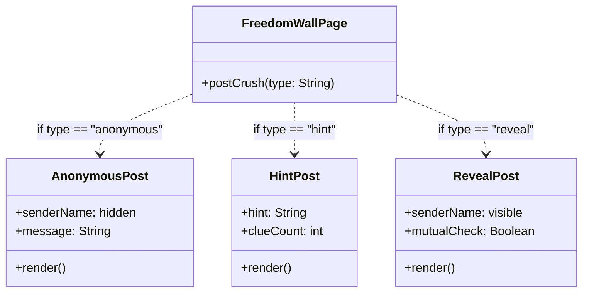
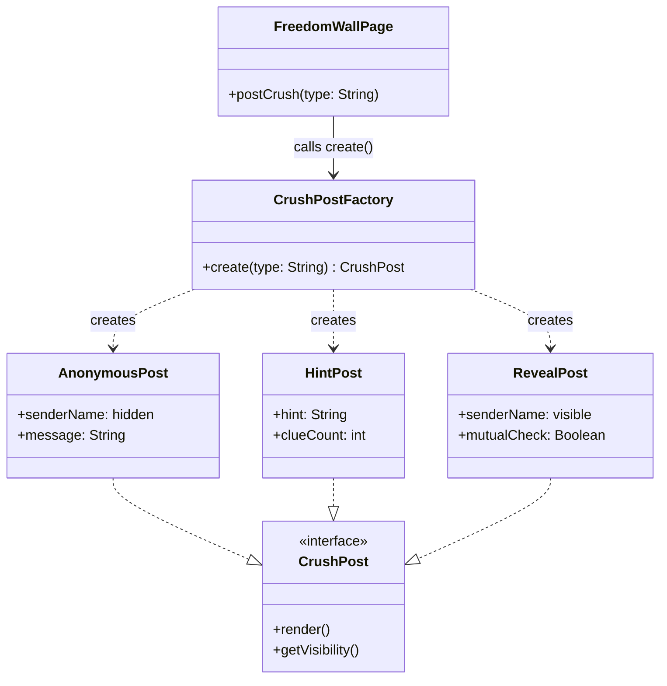
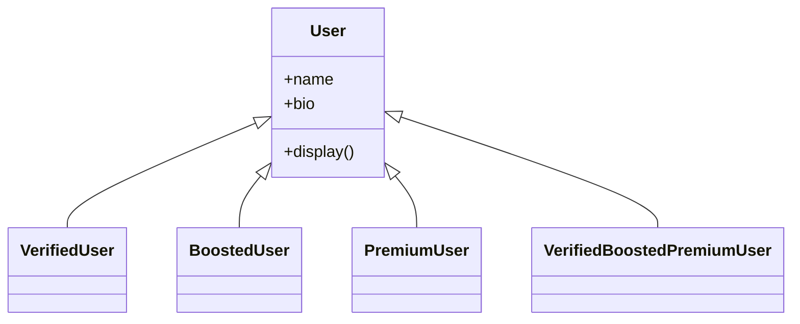
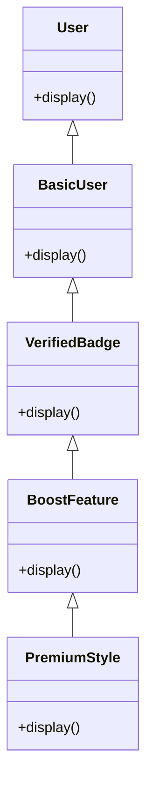
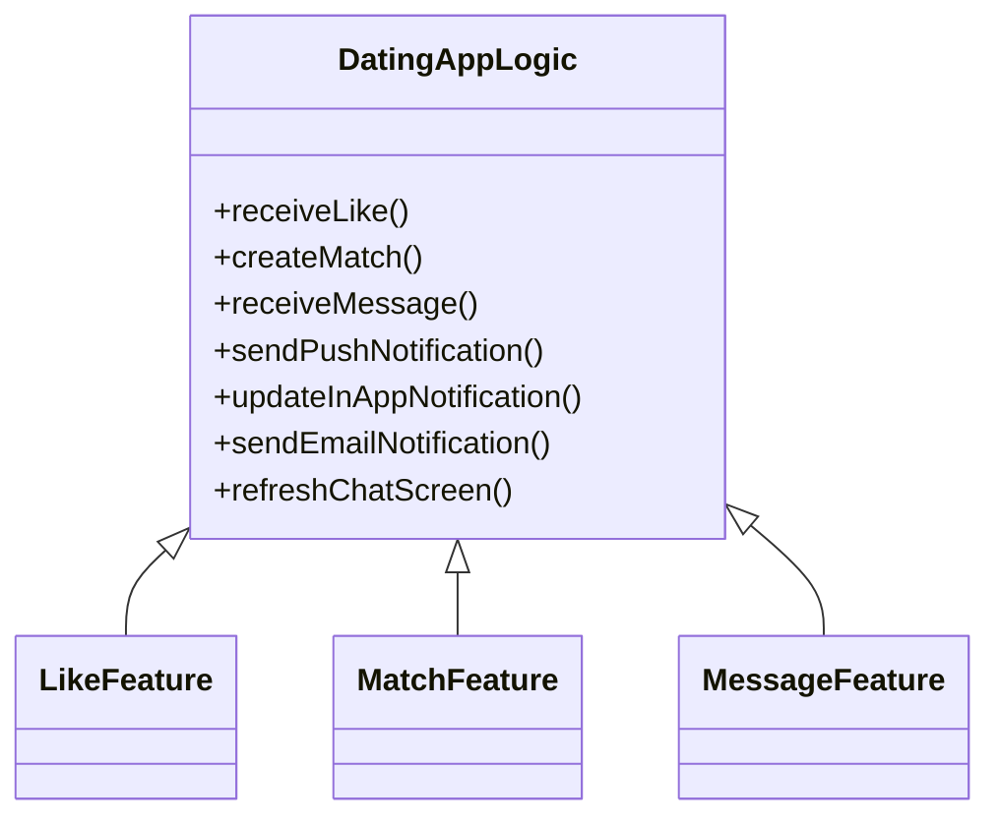
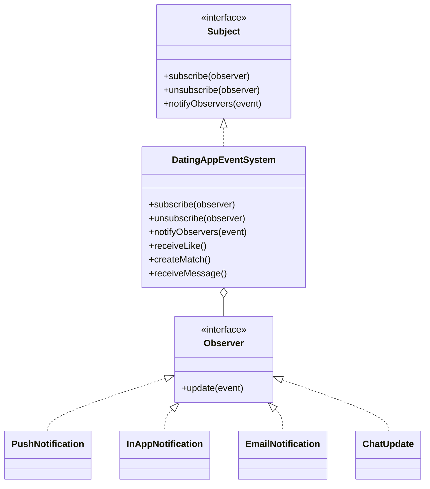

# 💘 UPV Freedom Wall Dating App

> **Twist:** Freedom Wall Feature — Crush ng Bayan Reveal

The **UPV Dating App** blends curated matching with an anonymous Freedom Wall, where students can post feelings, catch the campus buzz, and wait for the **Crush ng Bayan** reveal to see who is stealing hearts across the Miagao campus. The app is designed to seamlessly manage various student profile types while letting you stack extra features, like verified badges, to stand out from the crowd. With instant updates for every like, match, and message, you are always in the loop for every campus *ganap*.

---

## 🏗️ Design Pattern #1: Creational — Factory Method

### Pattern

**Factory Method**

Applied to: **Freedom Wall — Crush Post Creation**

### Concept in Conyo

Sa Freedom Wall, pwede kang mag-post ng crush mo in three ways:

| Post Type | Meaning |
| --- | --- |
| **Anonymous** | Huwag malaman kung sino ka |
| **Hint** | Pahiwatig lang |
| **Reveal** | Lahat alam, sana mutual 🙏 |

Iba-iba sila ng structure, content, at visibility. So ang tanong is: sino ang magde-decide kung anong klase ng post ang gagawin?

'Yan ang trabaho ng  **Factory Method**. Si `CrushPostFactory` na lang ang bahala sa creation. Ikaw? `create("hint")` lang, tapos na. Hindi mo na kailangan isipin kung paano siya ginawa.

### Visual Diagram

#### ❌ Without Factory Method



#### ✅ With Factory Method



### Why it Works Nga

| Approach | Result |
| --- | --- |
| ✅ **With Factory** | May isang object na lang na responsible sa paggawa ng post. Lahat ng pages tatawag lang kay `CrushPostFactory`, so adding a new post type is easier and more consistent. |
| ❌ **Without Factory** | Every page na gumagamit ng crush post kailangang mag-decide kung anong type ang gagawin. Kapag may new post type, maraming places ang kailangang baguhin. |

### Pseudocode

```text
interface CrushPost {
    render()
    getVisibility()
}

class AnonymousPost implements CrushPost:
    senderName = "[hidden]"
    message: String

    constructor(message):
        this.message = message

    render():
        return PostCard(
            header    = "Someone has a crush on you...",
            body      = this.message,
            senderTag = "Anonymous"
        )

    getVisibility():
        return "anonymous"

class HintPost implements CrushPost:
    hint: String
    clueCount: int

    constructor(hint, clueCount):
        this.hint      = hint
        this.clueCount = clueCount

    render():
        return PostCard(
            header    = "You have a secret admirer...",
            body      = "Hint: " + this.hint,
            senderTag = "? (" + this.clueCount + " clues left)"
        )

    getVisibility():
        return "hint"

class RevealPost implements CrushPost:
    senderName: String
    targetName: String
    mutualCheck = false

    constructor(senderName, targetName):
        this.senderName = senderName
        this.targetName = targetName

    render():
        return PostCard(
            header    = this.senderName + " has a crush on you!",
            body      = "Do you feel the same? Tap to find out.",
            senderTag = this.senderName,
            action    = "Reveal Match"
        )

    getVisibility():
        return "revealed"

class CrushPostFactory:
    create(type, params) -> CrushPost:
        if type == "anonymous":
            return new AnonymousPost(params["message"])
        else if type == "hint":
            return new HintPost(params["hint"], params["clueCount"])
        else if type == "reveal":
            return new RevealPost(params["senderName"], params["targetName"])
        else:
            throw Error("Unknown post type: " + type)

class FreedomWallPage:
    post = CrushPostFactory.create(formData["type"], formData)
    displayOnWall(post.render())
    saveToDatabase(post)
    sendNotificationTo(formData["targetName"], post.getVisibility())
```

---

## 🧩 Design Pattern #2: Structural — Decorator

### Pattern

**Decorator**

Applied to: **Adding badges, boosts, or profile features**

### Concept in Conyo

The Decorator Pattern is used when you want to add extra features to an object without changing its original structure. Instead na i-rewrite mo ang whole class, you just **wrap** it with additional behavior.

Sa dating app, imagine mo yung basic user profile: name, age, and bio. Pero siyempre, users want extra features like:

- Verified badge
- Boost profile
- Premium styling

Instead na gumawa ng iba’t ibang subclasses like `PremiumUser`, `VerifiedUser`, and `BoostedUser`, we decorate the base profile dynamically.

So parang: “Ay gusto ko may badge + boost + highlight... sige, i-stack lang natin as decorators.”

### Visual Diagram

#### ❌ Without Decorator



#### ✅ With Decorator



### Why it Works Nga

| Approach | Result |
| --- | --- |
| ✅ **With Decorator** | Isang base user lang, then features can be added dynamically. Pwedeng **Verified** lang, **Verified + Boost**, or all features, without creating a new class for every combination. |
| ❌ **Without Decorator** | Ang daming subclasses. Kada combination ng features kailangan ng bagong class, which becomes hard to maintain and extend. |

### Pseudocode

```text
interface User {
    display()
}

class BasicUser implements User {
    display() {
        print("Basic Profile")
    }
}

class UserDecorator implements User {
    protected User user

    constructor(user) {
        this.user = user
    }

    display() {
        user.display()
    }
}

class VerifiedBadge extends UserDecorator {
    display() {
        user.display()
        print("+ Verified Badge")
    }
}

class BoostFeature extends UserDecorator {
    display() {
        user.display()
        print("+ Boosted Profile")
    }
}

class PremiumStyle extends UserDecorator {
    display() {
        user.display()
        print("+ Premium Design")
    }
}

MAIN:
user = new BasicUser()

user = new VerifiedBadge(user)
user = new BoostFeature(user)
user = new PremiumStyle(user)

user.display()
```

---

## 🔔 Design Pattern #3: Behavioral — Observer

### Pattern

**Observer**

Applied to: **User notifications for likes, matches, and messages**

### Concept in Conyo

The Observer Pattern is parang “notify me when there’s a ganap” feature. Ginagamit siya when one main object has an update, and many other objects need to be notified automatically.

Sa dating app, the `DatingAppEventSystem` is the main source of ganap. Kapag may user na nakareceive ng like, nagkaroon ng match, or may bagong message, the app does not manually update every notification feature one by one.

Instead, mag-aannounce lang yung event system na “uy, there’s a ganap!” Then the observers, like push notifications, in-app notifications, email notifications, and chat updates, react on their own.

### Visual Diagram

#### ❌ Without Observer



#### ✅ With Observer



### Why it Works Nga

| Approach | Result |
| --- | --- |
| ✅ **With Observer** | The event system announces updates once, then all subscribed notification features react automatically. Adding a new notification channel only means adding another observer. |
| ❌ **Without Observer** | The main dating app logic has to directly call every notification feature. Kapag may bagong notification type, the core logic gets edited again and again. |

### Pseudocode

```text
interface Observer {
    update(event, data)
}

interface Subject {
    subscribe(observer)
    unsubscribe(observer)
    notifyObservers(event, data)
}

class DatingAppEventSystem implements Subject {
    observers = []

    subscribe(observer) {
        observers.add(observer)
    }

    unsubscribe(observer) {
        observers.remove(observer)
    }

    notifyObservers(event, data) {
        for each observer in observers {
            observer.update(event, data)
        }
    }

    receiveLike(fromUser, toUser) {
        notifyObservers("LIKE_RECEIVED", fromUser + " liked " + toUser)
    }

    createMatch(userOne, userTwo) {
        notifyObservers("MATCH_CREATED", userOne + " matched with " + userTwo)
    }

    receiveMessage(fromUser, toUser, message) {
        notifyObservers("MESSAGE_RECEIVED", fromUser + " messaged " + toUser)
    }
}

class PushNotification implements Observer {
    update(event, data) {
        print("Push Notification: " + event)
    }
}

class InAppNotification implements Observer {
    update(event, data) {
        print("In-App Notification: " + data)
    }
}

class EmailNotification implements Observer {
    update(event, data) {
        print("Email Notification: " + data)
    }
}

class ChatUpdate implements Observer {
    update(event, data) {
        if event == "MESSAGE_RECEIVED" {
            print("Chat Screen Updated")
        }
    }
}

MAIN:
datingApp = new DatingAppEventSystem()

push = new PushNotification()
inApp = new InAppNotification()
email = new EmailNotification()
chat = new ChatUpdate()

datingApp.subscribe(push)
datingApp.subscribe(inApp)
datingApp.subscribe(email)
datingApp.subscribe(chat)

datingApp.receiveLike("Alex", "Sam")
datingApp.createMatch("Alex", "Sam")
datingApp.receiveMessage("Alex", "Sam", "Hi!")
```