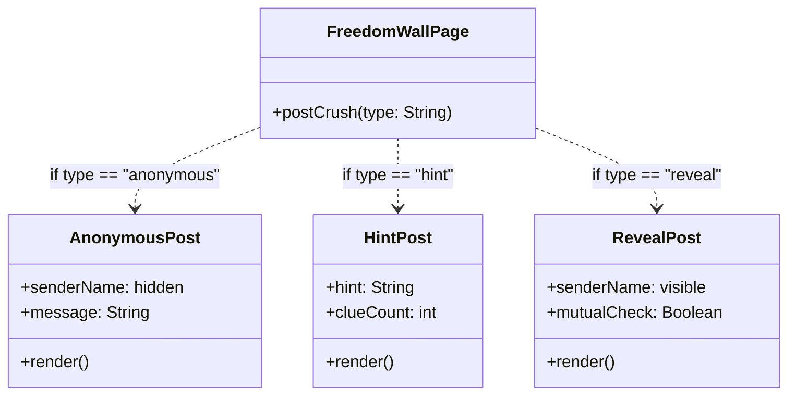
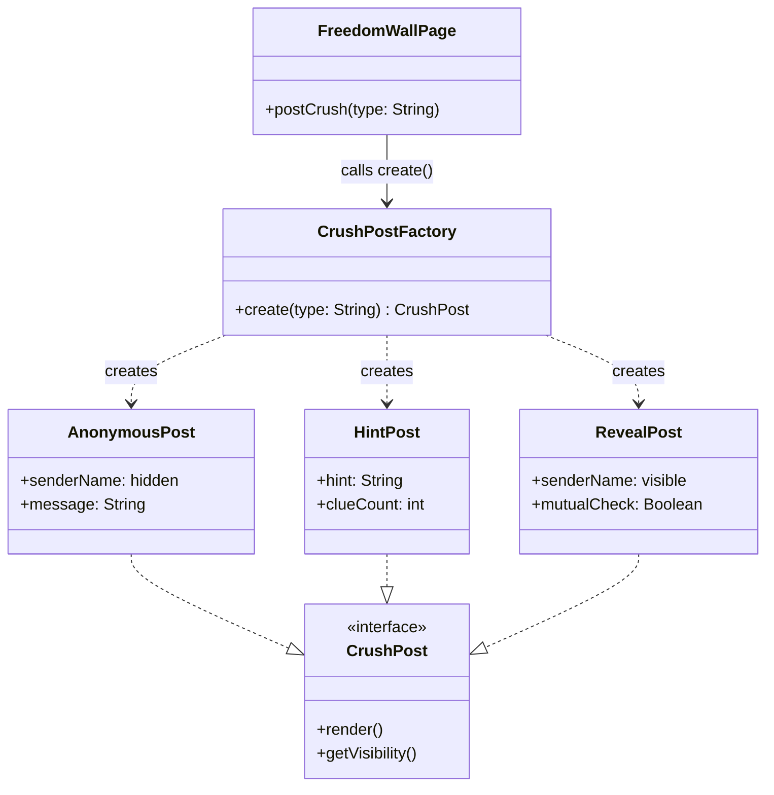

# 💘 UPV Freedom Wall Dating App

> **Twist:** Freedom Wall Feature — Crush ng Bayan Reveal

The **UPV Dating App** blends curated matching with an anonymous Freedom Wall, where students can post feelings, catch the campus buzz, and wait for the **Crush ng Bayan** reveal to see who is stealing hearts across the Miagao campus. The app is designed to seamlessly manage various student profile types while letting you stack extra features, like verified badges, to stand out from the crowd. With instant updates for every like, match, and message, you are always in the loop for every campus *ganap*.

---

## 🏗️ Design Pattern #1: Creational — Factory Method

### Pattern

**Factory Method**

Applied to: **Freedom Wall — Crush Post Creation**

### Concept in Conyo

Sa Freedom Wall, pwede kang mag-post ng crush mo in three ways:

| Post Type | Meaning |
| --- | --- |
| **Anonymous** | Huwag malaman kung sino ka |
| **Hint** | Pahiwatig lang |
| **Reveal** | Lahat alam, sana mutual 🙏 |

Iba-iba sila ng structure, content, at visibility. So ang tanong is: sino ang magde-decide kung anong klase ng post ang gagawin?

'Yan ang trabaho ng  **Factory Method**. Si `CrushPostFactory` na lang ang bahala sa creation. Ikaw? `create("hint")` lang, tapos na. Hindi mo na kailangan isipin kung paano siya ginawa.

### Visual Diagram

#### ❌ Without Factory Method



#### ✅ With Factory Method



### Why it Works Nga

| Approach | Result |
| --- | --- |
| ✅ **With Factory** | May isang object na lang na responsible sa paggawa ng post. Lahat ng pages tatawag lang kay `CrushPostFactory`, so adding a new post type is easier and more consistent. |
| ❌ **Without Factory** | Every page na gumagamit ng crush post kailangang mag-decide kung anong type ang gagawin. Kapag may new post type, maraming places ang kailangang baguhin. |

### Pseudocode

```text
interface CrushPost {
    render()
    getVisibility()
}

class AnonymousPost implements CrushPost:
    senderName = "[hidden]"
    message: String

    constructor(message):
        this.message = message

    render():
        return PostCard(
            header    = "Someone has a crush on you...",
            body      = this.message,
            senderTag = "Anonymous"
        )

    getVisibility():
        return "anonymous"

class HintPost implements CrushPost:
    hint: String
    clueCount: int

    constructor(hint, clueCount):
        this.hint      = hint
        this.clueCount = clueCount

    render():
        return PostCard(
            header    = "You have a secret admirer...",
            body      = "Hint: " + this.hint,
            senderTag = "? (" + this.clueCount + " clues left)"
        )

    getVisibility():
        return "hint"

class RevealPost implements CrushPost:
    senderName: String
    targetName: String
    mutualCheck = false

    constructor(senderName, targetName):
        this.senderName = senderName
        this.targetName = targetName

    render():
        return PostCard(
            header    = this.senderName + " has a crush on you!",
            body      = "Do you feel the same? Tap to find out.",
            senderTag = this.senderName,
            action    = "Reveal Match"
        )

    getVisibility():
        return "revealed"

class CrushPostFactory:
    create(type, params) -> CrushPost:
        if type == "anonymous":
            return new AnonymousPost(params["message"])
        else if type == "hint":
            return new HintPost(params["hint"], params["clueCount"])
        else if type == "reveal":
            return new RevealPost(params["senderName"], params["targetName"])
        else:
            throw Error("Unknown post type: " + type)

class FreedomWallPage:
    post = CrushPostFactory.create(formData["type"], formData)
    displayOnWall(post.render())
    saveToDatabase(post)
    sendNotificationTo(formData["targetName"], post.getVisibility())
```

---


```


```
