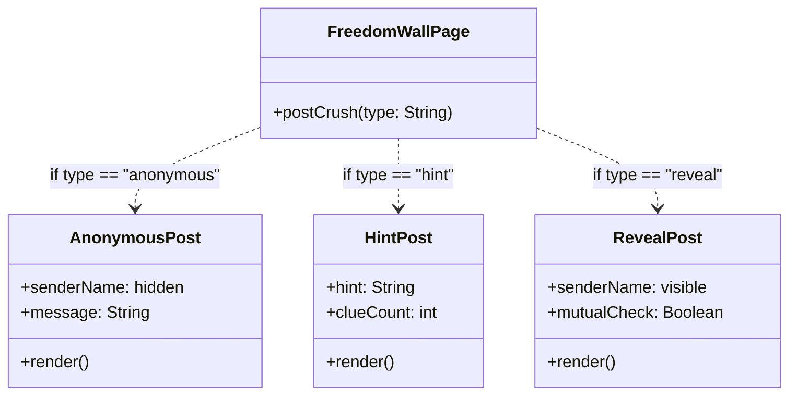
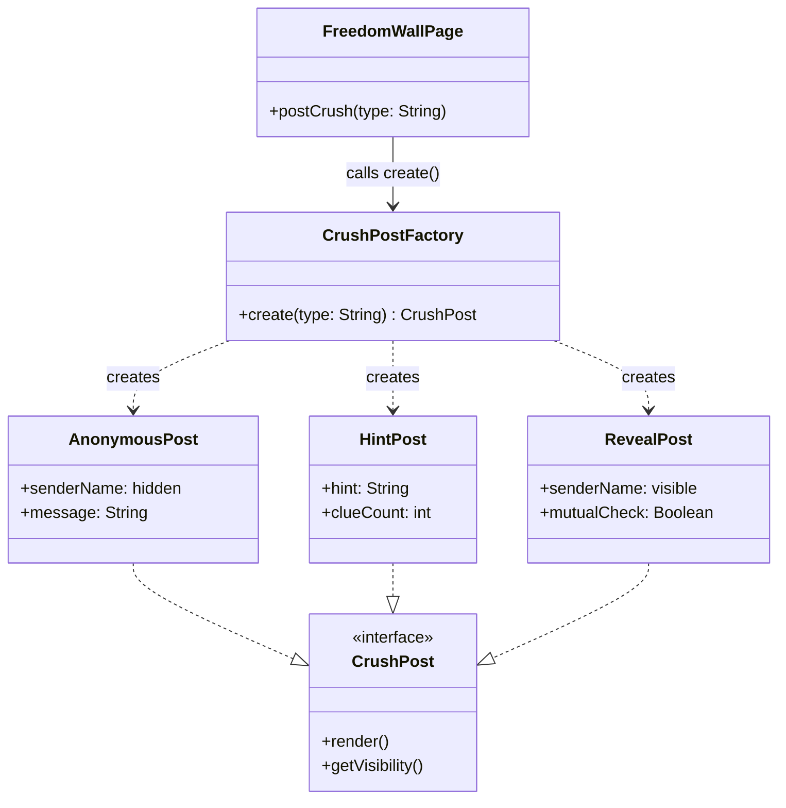

## 🏗️ Design Pattern #1: Creational — Factory Method

### i. Name of Pattern
**Creational – Factory Method**
Applied to: **Freedom Wall — Crush Post Creation**

---

### ii. Concept in Conyo

Okay so 'yung Freedom Wall is yung pinaka-iconic twist ng ating app —
dito ka mag-po-post ng crush mo, pero may choice ka kung gaano ka ka-bold:
gusto mo bang manatiling **anonymous**, mag-iwan ng **hint lang**, o
**i-reveal na** ang sarili mo at tignan kung mutual?

Tatlong klase ng post. Iba-iba ang structure nila, iba ang content,
iba ang visibility rules.

'Yun ang problema: kung wala kang Factory, ikaw mismo ang mag-de-decide
sa code mo kung anong klase ng post ang gagawin — sa bawat screen,
sa bawat function, pati na rin sa notification at feed rendering.
Paulit-ulit. Everywhere.

**'Yung Factory Method** is naglalagay ng isang "counter" in the middle —
si `CrushPostFactory`. Siya lang ang nakakaalam kung paano gagawin
ang bawat type ng post. Ang `FreedomWallPage`? Tatawag lang siya ng
`CrushPostFactory.create("hint")` — tapos bahala na ang factory.
Hindi na niya kailangan malaman kung ano ang nasa loob.

> Parang 'yung canteen window sa UPV — hindi mo kailangan malaman
> kung paano niluluto ang pagkain. Sabihin mo lang kung ano gusto mo,
> ibigay nila sayo.

Ginagamit ang Factory kapag:
- Maraming **types ng isang object** ang posible
- 'Yung choice kung **anong type** ay depende sa input ng user
- Ayaw mong mag-duplicate ng creation logic sa buong codebase

---

### iii. Visual Diagram

#### ❌ Without Factory Method



#### ✅ With Factory Method



---

### iv. Why it Works Nga

#### ❌ Without Factory — Kaloka ang maintenance nito

Kung walang factory, ganito ang mangyayari sa code:

```
// Sa FreedomWallPage
if type == "anonymous":
    post = new AnonymousPost(message)
elif type == "hint":
    post = new HintPost(hint, clueCount)
elif type == "reveal":
    post = new RevealPost(senderName, mutualCheck)
```

At ilalagay mo 'yan sa — `FreedomWallPage`. Tapos sa `FeedPage`.
Tapos sa `NotificationService`. Tapos sa `AdminModerationPage`.
**Sa lahat ng lugar na kailangan lumikha ng post.**

Mag-add ka ng bagong type — like `SuperCrushPost` na may countdown timer?
Hanapin mo lahat ng if-else sa buong codebase. Miss ka ng isa?
Silent bug. Hindi mo malalaman hanggang mag-crash na.

Malaki rin ang chance ng **inconsistency** — baka iba ang AnonymousPost
na ginawa sa Feed versus sa Notification. Dalawang lugar, dalawang code path,
dalawang potential na bug.

#### ✅ With Factory — Isang lugar, isang responsibilidad

Sa Factory Method, **isa lang ang nagtataglay ng creation logic**:
si `CrushPostFactory`.

- `FreedomWallPage` calls `CrushPostFactory.create("hint")` — tapos na siya.
- `FeedPage` calls the same factory. `NotificationService` — same factory.
- Mag-add ng `SuperCrushPost`? **Isa lang ang babaguhin: ang factory.**
  Lahat ng callers? Hindi na nila kailangan malaman. Walang nagbabago sa kanila.

Hindi lang ito tungkol sa convenience — ito ay tungkol sa **trustworthiness** ng code.
Guaranteed na consistent ang lahat ng `AnonymousPost` sa buong app
dahil isa lang ang gumagawa. Mas madali i-test. Mas madaling i-debug.

> **TL;DR:** Without factory, ang logic ng creation ay nakakalat sa buong app
> tulad ng tsismis sa hallway — bawat isa ay may sariling version.
> With factory, may official source of truth — at siya lang ang pinagkakatiwalaan.

---

### v. Pseudocode

```
// ============================================================
// INTERFACE: Lahat ng crush post types ay sumusunod dito
// ============================================================
interface CrushPost:
    render()         → PostCard
    getVisibility()  → String   // "anonymous" | "hint" | "revealed"


// ============================================================
// CONCRETE POST TYPES
// ============================================================

class AnonymousPost implements CrushPost:
    senderName = "[hidden]"
    message    : String

    constructor(message: String):
        this.message = message

    render():
        return PostCard(
            header     = "Someone has a crush on you...",
            body       = this.message,
            senderTag  = "Anonymous"
        )

    getVisibility():
        return "anonymous"


class HintPost implements CrushPost:
    hint       : String
    clueCount  : int
    senderName = "[hidden]"

    constructor(hint: String, clueCount: int):
        this.hint      = hint
        this.clueCount = clueCount

    render():
        return PostCard(
            header    = "You have a secret admirer...",
            body      = "Hint: " + this.hint,
            senderTag = "? (" + this.clueCount + " clues left)"
        )

    getVisibility():
        return "hint"


class RevealPost implements CrushPost:
    senderName  : String
    targetName  : String
    mutualCheck : Boolean

    constructor(senderName: String, targetName: String):
        this.senderName  = senderName
        this.targetName  = targetName
        this.mutualCheck = false   // starts unchecked until target responds

    render():
        return PostCard(
            header    = this.senderName + " has a crush on you!",
            body      = "Do you feel the same? Tap to find out.",
            senderTag = this.senderName,
            action    = "Reveal Match"
        )

    getVisibility():
        return "revealed"


// ============================================================
// THE FACTORY — only class that decides which post to create
// ============================================================
class CrushPostFactory:

    create(type: String, params: Map) → CrushPost:
        if type == "anonymous":
            return new AnonymousPost(
                message = params["message"]
            )
        else if type == "hint":
            return new HintPost(
                hint      = params["hint"],
                clueCount = params["clueCount"]
            )
        else if type == "reveal":
            return new RevealPost(
                senderName = params["senderName"],
                targetName = params["targetName"]
            )
        else:
            throw Error("Unknown post type: " + type)


// ============================================================
// USAGE — FreedomWallPage stays clean, walang creation logic dito
// ============================================================
class FreedomWallPage:

    handlePostSubmit(type: String, formData: Map):
        // Factory bahala sa kung anong klase ng post
        post = CrushPostFactory.create(type, formData)

        // Use the post — hindi na nagtatanong kung anong type
        card = post.render()
        displayOnWall(card)
        saveToDatabase(post)
        sendNotificationTo(formData["targetName"], post.getVisibility())
```
