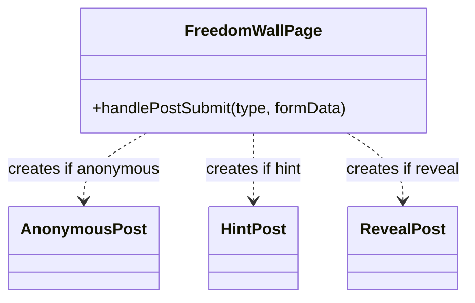
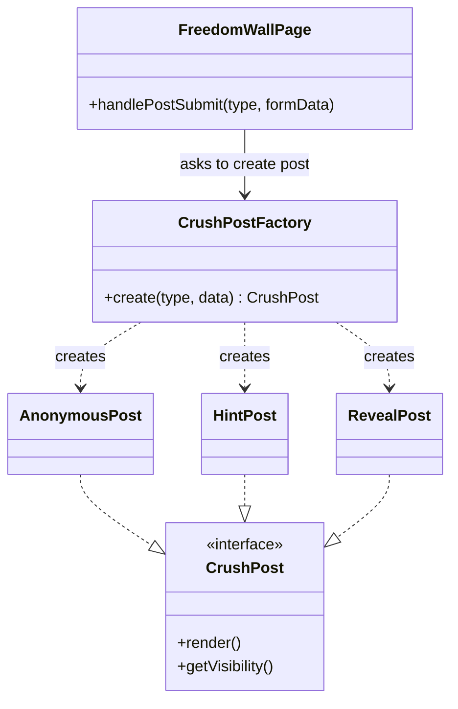

# 💘 UPV Freedom Wall Dating App

> **Twist:** Freedom Wall Feature — Crush ng Bayan Reveal

The **UPV Dating App** blends curated matching with an anonymous Freedom Wall, where students can post feelings, catch the campus buzz, and wait for the **Crush ng Bayan** reveal to see who is stealing hearts across the Miagao campus. The app is designed to seamlessly manage various student profile types while letting you stack extra features, like verified badges, to stand out from the crowd. With instant updates for every like, match, and message, you are always in the loop for every campus *ganap*.

---

## 🏗️ Design Pattern #1: Creational — Factory Method

### i. Name of Pattern
**Creational – Factory Method**
Applied to: **Freedom Wall — Crush Post Creation**

---

### ii. Concept in Conyo

Sa Freedom Wall, pwede kang mag-post ng crush mo in three ways: **anonymous** (huwag malaman kung sino ka), **hint** (pahiwatig lang), o **reveal** (lahat alam, sana mutual 🙏).

Iba-iba sila ng structure, content, at visibility — so ang tanong is, sino ang mag-de-decide kung anong klase ng post ang gagawin?

'Yan ang trabaho ng **Factory Method** — si `CrushPostFactory` na lang ang bahala sa creation. Ikaw? `create("hint")` lang, tapos na. Hindi mo na kailangan pag-isipan kung paano siya ginawa.

---

### iii. Visual Diagram

#### ❌ Without Factory Method



#### ✅ With Factory Method



---

### iv. Why it Works Nga

**✅ With Factory** — may isa na lang na nagde-decide. Lahat ng pages? Tatawag lang kay `CrushPostFactory` — siya na bahala. May bago kang post type? Sabihin mo kay Factory, tapos done. Lahat updated, walang maiiwanan.

**❌ Without Factory** — every page na gumagamit ng crush post ay kailangan mag-decide kung anong type ang gagawin. It's like deciding separately kung saan kayo kakain — walang consistent na desisyon, tapos pag may bago kayong option, kailangan mo pa sabihin sa lahat isa-isa.

---

### v. Pseudocode

```
interface CrushPost:
    render()
    getVisibility()


class AnonymousPost implements CrushPost
class HintPost implements CrushPost
class RevealPost implements CrushPost


class CrushPostFactory:
    create(type, data):
        switch type:
            case "anonymous":
                return new AnonymousPost(data.message)

            case "hint":
                return new HintPost(data.hint, data.clueCount)

            case "reveal":
                return new RevealPost(data.senderName, data.targetName)

            default:
                throw Error("Unknown post type")


class FreedomWallPage:
    handlePostSubmit(type, formData):
        post = CrushPostFactory.create(type, formData)

        displayOnWall(post.render())
        saveToDatabase(post)
        sendNotification(post.getVisibility())
```
